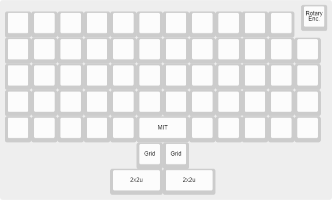

# 7c8 Framework


Framework is a 5x12 ortholinear keyboard featuring:

* All through-hole components (except Kailh hotswap sockets)
* QMK firmware with VIA support
* Rotary encoder
* Hotswappable switches
* FR-4 and acrylic sandwich construction
* USB Type-C
* MIT (one 2u), grid (two 1u), and two 2u, bottom row configuration

## Info

### Discord

https://discord.gg/MpxnD9PygN

### License

Framework is licensed under [CC BY-NC-SA 4.0](https://creativecommons.org/licenses/by-nc-sa/4.0/). Please modify my design to make a keyboard that fits you!

### Revisions

**rev0** is an early prototype/proof of concept  
**rev1** is the current revision and should be used for fabrication or modification

### General

The ATmega328P does not come with a USB bootloader from factory. You will need to flash the chip with a bootloader through the ISP header first. You can find a pre-compiled .hex to flash at [USBaspLoader/bootloader.hex](USBaspLoader/bootloader.hex), or compile your own using the documentation found in the [USBaspLoader/](USBaspLoader/) folder. Everything has been preconfigured for use with the Framework.

[USBaspLoader](https://github.com/baerwolf/USBaspLoader) is a project maintained by [Stephan Baerwolf](https://github.com/baerwolf).

Fuse bytes should be:
* lfuse = 0xd7
* hfuse = 0xd0
* efuse = 0xfc

After [setting up your QMK environment](https://beta.docs.qmk.fm/tutorial/newbs_getting_started), flash the Framework firmware:

```
make 7c8/framework:default:flash # default keymap
make 7c8/framework:via:flash     # via-compatible keymap
```

Alternatively, a precompiled .hex with bootloader and Framework QMK firmware with VIA support can be found at [firmware/bl_framework_via.hex](firmware/bl_framework_via.hex). Flashing/fusing with avrdude looks like this:

```
avrdude -c <programmer> -p atmega328p -U flash:w:bl_framework_via.hex:i -U lfuse:w:0xd7:m -U hfuse:w:0xd0:m -U efuse:w:0xfc:m
```

### Layout

Framework supports MIT, grid, and 2x2u spacebar layouts. Refer to [framework.h](qmk/7c8/framework/framework.h). Layout options are also configurable in VIA.



### Physical construction

Please see [this separate note on physical construction](doc/physicalconstruction.md).
